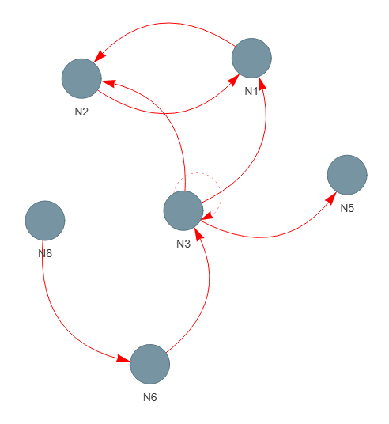
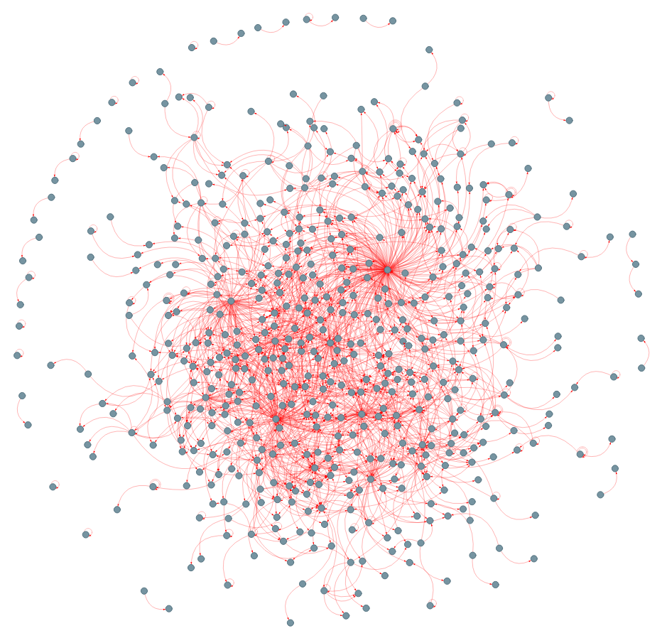

# Fibration symmetries on Python

This is a python implementation of https://github.com/makselab/FastFibration fast fibration partitioning (FFP) algorithm

Initally, the algorithm was presented in [Morone et. al.](https://www.pnas.org/content/117/15/8306) in 2021. In 2025, FFP was used extensively in [Symmetries of Living Systems: Symmetry Fibrations and Synchronization in Biological Networks](https://arxiv.org/pdf/2502.18713)

## Usage 

To find the fibration partitioning of a given directed network, only the information of the network structure (nodes and edges) 
and the types of each edge (if edges are multidimensional) are necessary. 
For this, the network must be parsed as a **CSV file** located in the **Graphs/** directory, and follow the structure of an edgelist containing two essential informations (source and target) and one optional information (the type of the edge for multiplex scenarios). 

For instance, let us consider the network below where the edges can assume two possible values: 'positive' or 'negative'.


The edgefile for this network, called `Graphs/net.csv` should follow the format below:

```
SourceName,TargetName,Type,Source,Target
N1,N2,positive,1,2
N2,N1,positive,2,1
N3,N1,positive,3,1
N3,N4,positive,3,4
N4,N2,negative,4,2
N4,N3,positive,4,3
N4,N5,positive,4,5
N6,N3,negative,6,3
N7,N4,negative,7,4
N8,N6,positive,8,6
N8,N7,positive,8,7
```

The third column refers to the possible values of each edge. There is no restriction on the specific
format of its values as long as each different string represent a different edge type. For the first (source) and 
second (target) columns the node labels must be inside the interval \[1,N\] where N is the total number of nodes in
the graph.

To extract the fibers of the network provided by this edgefile, run the following: 

```
graph,df = graph_from_csv("Graphs/net.csv", is_directed=True)
fiber_partition = fast_fibration(graph)
```

This will generate the transformed graph, called the base, in **Bases/net.csv**

To visualize this base, run the following:

```
number_nontrivial_fibers, total_fibers, fiber_map = extract_fiber_groups(fiber_partition)
dump_fibration_base_to_csv(graph, fiber_map, fiber_map, "net.csv")
generate_graph_from_csv("base","net.csv")
```

This will produce a file called base.html, that you may open in your browser:



Note that this visualization doesnt render colored edge types, but the actual base generated in *Bases/net.csv* does. 

## Escherichia Coli metabolism

Running the full metabolome of Escherichia Coli (located in *Graphs/test_Ecoli.csv*) will produce a much larger base:



## Getting started
All your source graphs must be stored in CSV format in a subdirectory called *Graph/* and all bases produced by FFP will be stored in CSV format the *Bases/* subdirectory.

Run test.py to get started, then run fiber.py

The default *Graphs/* subdirectory the comes with this repository contains:
- graphs with strongly connected components (SCC): 3 components (3SCC), 6 components (6SCC)
- graphs depicted in **Symmetries of Living Systems: Symmetry Fibrations and Synchronization in Biological Networks**: figure 1.3 page 10, figure 4.2 page 49, figure 17.5 page 358
- graph of E.Coli metabolism (test_Ecoli.txt)

## License

                  GNU LESSER GENERAL PUBLIC LICENSE
                       Version 2.1, February 1999

 Copyright (C) 1991, 1999 Free Software Foundation, Inc.
 51 Franklin Street, Fifth Floor, Boston, MA  02110-1301  USA
 Everyone is permitted to copy and distribute verbatim copies
 of this license document, but changing it is not allowed.
